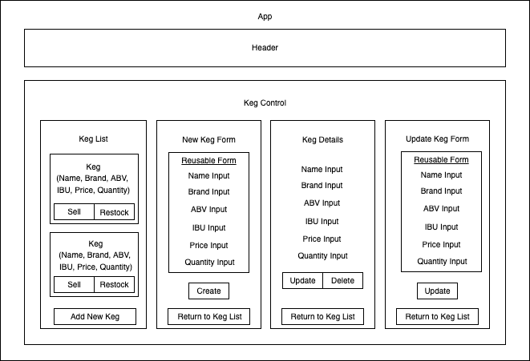

# 
 👨‍🎨 **Michelob Angelo's Pietàproom** 🍺 

_June 2, 2022_

#### _React merch website with full CRUD capability for a ficticious tap room_

#### By _**John Whitten**_

## Table of Contents

1. [Description](#description)
2. [Technologies Used](#technologies)
3. [Setup/Installation Requirements](#setup)
4. [Known Bugs](#bugs)
5. [Contact Information](#contact)
6. [License](#license)

## Description 
Build a tap room in React where a bar or kombucha store can track their kegs. This could also be a soda fountain or another kind of tracker - as long as the remaining amount is tracked and the objectives are met, creative with this prompt is welcome.

Before getting started, plan the application and draw a component tree or component diagram that shows the structure of your components. This is a requirement for the project and should be included in the README. 

This website components planning was created with https://www.draw.io/.

Only CREATE and READ functionality are expected, although full CRUD implenetation is welcome. 

With the following user stories as a place to start, the application should have the following functionality:

- As a user, I want to see a list/menu of all available kegs. For each keg, I want to see its name, brand, price and alcoholContent (or perhaps something like flavor for a kombucha store).
- As a user, I want to submit a form to add a new keg to a list.
- As a user, I want to be able to click on a keg to see its detail page.
- As a user, I want to see how many pints are left in a keg. Hint: A full keg has roughly 124 pints.
- As a user, I want to be able to click a button next to a keg whenever I sell a pint of it. This should decrease the number of pints left by 1. Pints should not be able to go below 0.

#### _Further Exploration_
_If there is time remaining after completing the required objectives, the following user stories are opportunities for further exploration:_

- As a user, I want the option to edit a keg's properties after entering them just in case I make a mistake.
- As a user, I want to be able to delete a keg.
- As a user, I want a keg to update to say "Out of Stock" once it's empty.
- As a user, I want kegs with less than 10 pints to include a message that says "Almost Empty" so I can try a pint before it's gone!
- As a user, I want to have kegs prices to be color-coded for easy readability. This could be based on their price, the style of beer or kombucha, or the amount of pints left.
- As a user, I want this application to be nicely styled. (Use stylesheets and CSS objects!)

## Website Components Planning

## Technologies Used 

* HTML
* CSS
* JavaScript/JSX
* NPM
* Webpack

## Project Setup/Installation Instructions 

* Navigate to the directory in which you would like to clone this project.
* Run `git clone https://github.com/johnwhittenstudio/tap-room.git` in terminal.
* Run `cd tap-room` to navigate into new project directory.
* Open the cloned repo in a text editor of your choice.
* Run `npm install` to download all dependencies.
* Run `npm run start` to start a live server and view projec in the browser.
* Run `npm run test` to run tests.

## Known Bugs 

- _None._

## Contact 
John Whitten - [Email](mailto:johnwhitten.studio@gmail.com) • [LinkedIn](https://www.linkedin.com/in/johnwhitten-studio/) • [GitHub](https://github.com/johnwhittenstudio)

## License 

Copyright (c) 2022 _**John Whitten**_

Permission is hereby granted, free of charge, to any person obtaining a copy of this software and associated documentation files (the "Software"), to deal in the Software without restriction, including without limitation the rights to use, copy, modify, merge, publish, distribute, sublicense, and/or sell copies of the Software, and to permit persons to whom the Software is furnished to do so, subject to the following conditions:

The above copyright notice and this permission notice shall be included in all copies or substantial portions of the Software.

THE SOFTWARE IS PROVIDED "AS IS", WITHOUT WARRANTY OF ANY KIND, EXPRESS OR IMPLIED, INCLUDING BUT NOT LIMITED TO THE WARRANTIES OF MERCHANTABILITY, FITNESS FOR A PARTICULAR PURPOSE AND NONINFRINGEMENT. IN NO EVENT SHALL THE AUTHORS OR COPYRIGHT HOLDERS BE LIABLE FOR ANY CLAIM, DAMAGES OR OTHER LIABILITY, WHETHER IN AN ACTION OF CONTRACT, TORT OR OTHERWISE, ARISING FROM, OUT OF OR IN CONNECTION WITH THE SOFTWARE OR THE USE OR OTHER DEALINGS IN THE SOFTWARE.